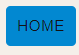

**<h3 id="inicio">Nombre de la APP</h3>**

1. [**Descripción del proyecto**](#Desc)
2. [**Introducción**](#Intro) 
3. [**Funcionalidades**](#Funcionalidades)
4. [**Requerimientos no funcionales**](#RnF)
5. [**Arquitectura**](#Arq)
6. [**Instalación y configuración**](#IC)
7. [**Mockups y mapa de navegación**](#MM)
8. [**Acerca de ...**](#About)
9. [**Autores del proyecto**](#Nosotros)

**<h3 id="Desc">Descripción del proyecto</h3>**
Este proyecto consiste en el diseño e implementación de una aplicación web implementada por estudiantes del Tecnólogo de Informática y supervisada por el docente del taller de Aplicaciones de Internet Ricas (RIA).

[**volver al menu**](#inicio)

**<h3 id="Intro">Introducción</h3>**

La transmisión por streaming, también llamada transmisión en directo, en continuo o en descarga continua, es un método de distribución de contenidos multimedia (audiovisuales) a través de redes informáticas, que transmite el contenido al instante mismo en que es consumido, sin que deba descargarse y almacenarse previamente. El término streaming proviene del inglés stream (“chorro” o “arroyo”) y hace alusión a la transmisión ininterrumpida del contenido audiovisual.

La transmisión de contenidos comerciales vía streaming se popularizó luego del año 2000 en el mundo entero, a medida que los servicios de ancho de banda permitían igualar la tasa de transmisión de datos necesaria para transmitir series, películas, podcasts y otros contenidos diferidos (o sea, grabados previamente) o bien diferentes servicios de televisión en vivo y directo. A diferencia de las emisiones televisivas o radiales tradicionales, contó con la virtud de que el usuario puede elegir qué contenido ver y cuándo.

Para tener acceso a este tipo de servicios se necesita una conexión a internet y uno o varios dispositivos capaces de reproducir audio y video, como televisores inteligentes, tablets, teléfonos inteligentes o computadoras. El éxito de esta tecnología, por lo tanto, va de la mano del incremento en el consumo de este tipo de aparatos, y de la mejoría en la capacidad de transmisión de datos de manera inalámbrica (4G y 5G).

[Fuente URL:](https://concepto.de/streaming/)  
[**volver al menu**](#inicio)

**<h3 id="Funcionalidades">Funcionalidades</h3>**

1. [Busqueda de títulos ](#BT)
2. [Filtrar por categoría](#FC)
3. [Ver información de películas/series](#VI)
4. [Volver a la pagina principal](#R)
5. [Reproducción de triler](#RT)

<h3 id="BT">Busqueda de títulos</h3>
Mediante la barra de búsqueda puedes ingresar el titulo que deseas buscar, y automaticamente se mostraran todas las similitudes de titulos de peliculas y series en el sistema. 

<h3 id="FC">Filtrar por categoría</h3>  

 

<h3 id="VI">Ver información de películas/series</h3>
Para acceder a la información del titulo de interes, basta con hacer clic sobre la imagen de portada de la pelicula o serie, y seras redireccionado a la ventana exclusiva del mismo.
Información disponible:
 - Nombre
 - Descripción
 - Calificación
 - Fecha de estreno
 - Lenguaje orinal  

 

 

<h3 id="R">Volver a la página principal</h3>
Para volver a la página principal (home) desde una ventana de información de la película o serie, debemos hacer clic sonre el botón "HOME" ubicado en la esquina superior derecha de la página.

 

 

<h3 id="RT">Reproducción de trailer</h3>
Ubicado en la página de la pelicula o serie seleccionada previamente podremos encontrar un boton "PLAY TRAILER" ubicado sobre la descripción. Este abrira una ventana de youtube en segundo plano mostrando el trailer completo. Si desea cerrar dicha ventana basta con hacer clic en el botón "CLOSE".
En caso de que no exista el trailer, el sistema depliega un mensaje, "Sorry, no trailer available"

 

 

[**volver al menu**](#inicio)

**<h3 id="RnF">Requerimientos no Funcionales</h3>**

- Conexión a internet

[**volver al menu**](#inicio)

**<h3 id="Arq">Arquitectura</h3>**
REST:(Representational State Transfer) es un estilo arquitectónico utilizado para diseñar servicios web, y se basa en los principios de utilizar los métodos HTTP (GET, POST, PUT, DELETE) para realizar operaciones en recursos.

- The Movie Database API3: es una API (Application Programming Interface) que proporciona un conjunto de endpoints o puntos de acceso que permiten acceder a datos relacionados con películas, series de televisión y otros contenidos relacionados con el cine. Al utilizar esta API, puedes realizar solicitudes HTTP utilizando los métodos adecuados para obtener información sobre películas, buscar películas, obtener detalles de actores, etc. Esto cumple con los principios de un servicio REST.
- ReactJS: también conocido como React, es una biblioteca de JavaScript de código abierto que se utiliza para construir interfaces de usuario interactivas y eficientes. Fue desarrollada por Facebook y se ha convertido en una de las bibliotecas más populares para el desarrollo de aplicaciones web modernas. Se eligió ReactJS debiado a que esta enfocada en la construcción de componentes reutilizables que representan diferentes partes de la interfaz de usuario. Esto lo hace mas eficiente y de mejor rendimiento.  
- Material UI: es una biblioteca de componentes de interfaz de usuario (UI) para React, que proporciona componentes predefinidos con estilos y funcionalidades específicas para facilitar el desarrollo de interfaces de usuario atractivas y coherentes. No es un servicio web en sí mismo, sino una biblioteca que puedes utilizar en tu aplicación para diseñar y presentar la interfaz de usuario.

[**volver al menu**](#inicio)

**<h3 id="IC">Instalación y configuración</h3>**  
Para la instalación de esta aplicación web es necesario tener npm(Node Package Manager) por lo tanto debemos instalar NODEjs que lo incluye. Esta plicación es compatible con todos los sistemas operativos.
Para realizar las instalaciones correspondientes es necesario contar con conexión a Internet, npm y un IDE.

 

- Descargar la versionmas reciente de Nodejs en: (https://nodejs.org) 
- Seguir las instrucciones de instalación dependiendo de tu sistema operativo.
En la terminal o consola:
- Verificar la instalación: node --version | npm --version
- Actualizar npm (opcional): npm install -g npm
- Acceder al repositorio de Githab: (https://github.com/camila-firpo/movie-app) y descargo el zip del proyecto.
- En mi sistema: creo una carpeta donde instalaré la aplicación web y descomprimo el zip descargado en el paso anterior.
- En el IDE de preferencia (recomendamos Visual Studio Code) abrimos la carpeta raíz donde se encuentra la aplicación y seguido, abrimos una nueva termnal en esa ubicación.
- Escribir el siguiente comando: npm intall
- Ahora solo queda correr la aplicación, npm run start -- --open

[**volver al menu**](#inicio)

**<h3 id="MM">Mockups y mapa de anvegacion</h3>**

Mockups  
Realizado en Figma: (www.figma.com)

Mapa de navegación  
Realizado en DiagramsNet: (https://app.diagrams.net/)

[**volver al menu**](#inicio)

**<h3 id="About">Acerca de ...</h3>**

Esta aplicación web está destinada al público en general para poder disfrutar de una variada categoria de títulos. El uso de esta plataforma te permite navegar intuitivamente y acceder a una gran selección de peliculas y series de todo el mundo.

[**volver al menu**](#inicio)

**<h3 id="Nosotros">Autores del proyecto</h3>**

. Camila Firpo  
. Diego Poblete  
. Adriana Pisano

[**volver al menu**](#inicio)

